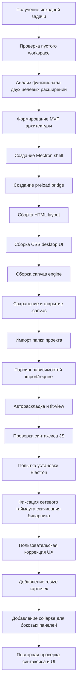

# Отчёт по декомпозиции и коррекциям

## 1. System Prompt & Context

Ниже зафиксирован только внешний, безопасный для передачи пользователю контекст планирования, без внутренних служебных инструкций и скрытых механизмов.

- Рабочая роль: архитектурный и UI-ориентированный ассистент по проектированию desktop-приложения.
- Цель: собрать автономное Electron-приложение, объединяющее сценарии `infinite canvas` и `code canvas`.
- Базовый приоритет:
  - сначала обеспечить рабочий каркас приложения;
  - затем реализовать базовый canvas interaction layer;
  - затем добавить импорт проекта и связи между file/code карточками;
  - затем улучшить UX по пользовательским правкам.
- Архитектурные ограничения:
  - приложение должно быть локальным и самостоятельным;
  - фронтенд должен быть без тяжёлой внешней зависимости на framework;
  - структура должна быть понятной для дальнейшего развития;
  - данные canvas должны сериализоваться в `.canvas` / `.json`.
- Стиль проектирования:
  - тёмный desktop UI;
  - упор на наглядность графа;
  - канвас как основная рабочая сцена;
  - редактирование через инспектор без усложнения базовой модели состояния.

## 2. Первоначальная декомпозиция задачи

```text
Standalone Electron App
├─ Shell / Boot
│  ├─ package.json
│  ├─ Electron main process
│  └─ preload bridge
├─ Renderer UI
│  ├─ topbar / toolbar
│  ├─ left panel (режимы / подсказки)
│  ├─ canvas stage
│  ├─ right inspector
│  └─ status bar
├─ Canvas Engine
│  ├─ viewport state
│  ├─ pan / zoom
│  ├─ node rendering
│  ├─ edge rendering
│  ├─ selection model
│  └─ inspector bindings
├─ Data Model
│  ├─ text nodes
│  ├─ code nodes
│  ├─ file nodes
│  ├─ edges
│  └─ viewport serialization
├─ File Workflow
│  ├─ save canvas
│  ├─ open canvas
│  └─ demo canvas example
└─ Project Import
   ├─ folder picker
   ├─ source file scan
   ├─ content preview extraction
   ├─ dependency parsing
   └─ auto-layout
```

## 3. Коррекции после пользовательского фидбэка

### Коррекция 1

Запрос:

- добавить изменение размера карточек
- добавить скрытие / сворачивание поля `Режим`
- добавить скрытие / сворачивание `Инспектора`

Результат декомпозиции коррекции:

```text
UX Corrections
├─ Card Resize
│  ├─ resize handle in node template
│  ├─ resize interaction state
│  ├─ min width / min height guards
│  └─ rerender edges after resize
└─ Sidebar Collapse
   ├─ collapse buttons inside sidebars
   ├─ collapsed UI state
   ├─ rail buttons on stage for restore
   └─ layout-safe show / hide behavior
```

## 4. Воркфлоу реализации



### Дерево изменения файлов

```text
code-canvas-electron/
├─ package.json
│  └─ стартовый Electron-пакет
├─ main.js
│  ├─ окно приложения
│  ├─ системное меню
│  ├─ open/save dialogs
│  ├─ scanProject()
│  └─ dependency graph extraction
├─ preload.js
│  └─ bridge между renderer и Electron API
├─ src/index.html
│  ├─ shell layout
│  ├─ sidebar controls
│  └─ node template + resize handle
├─ src/styles.css
│  ├─ desktop theme
│  ├─ graph visuals
│  ├─ collapsed sidebar states
│  └─ resize-handle visuals
├─ src/app.js
│  ├─ state model
│  ├─ render nodes / edges
│  ├─ pan / zoom / drag
│  ├─ save / open canvas
│  ├─ import project
│  ├─ resize cards
│  └─ collapse sidebars
├─ examples/demo.canvas
│  └─ демо сериализованного canvas
├─ README.md
│  └─ описание проекта и roadmap
└─ .gitignore
   └─ служебные исключения
```

## 5. Анализ модификаций

Git-коммиты в репозитории не создавались. Ниже приведены логические пакеты изменений.

### Пакет A. Базовый каркас приложения

Изменения:

- создан `package.json`
- создан `main.js`
- создан `preload.js`
- создан `src/index.html`
- создан `src/styles.css`
- создан `src/app.js`
- создан `README.md`
- создан `examples/demo.canvas`

Смысл:

- сформирован самостоятельный desktop-каркас приложения;
- введён безопасный обмен между renderer и main process;
- подготовлена модель canvas-редактора.

### Пакет B. Реализация canvas-функционала

Изменения:

- добавлены state-сущности для `nodes`, `edges`, `viewport`, `selection`;
- реализованы `pan`, `zoom`, `drag`;
- добавлены text/code/file node rendering;
- добавлены связи и временная линия связи;
- внедрён инспектор справа.

Смысл:

- получен рабочий интерактивный canvas;
- подготовлена база под дальнейшие расширения.

### Пакет C. Импорт проекта и code graph

Изменения:

- реализован выбор папки проекта;
- реализовано сканирование текстовых файлов;
- добавлен preview содержимого файлов;
- добавлен парсинг `import`, `require`, `dynamic import`;
- построены связи между файлами;
- добавлены `autoLayout()` и `fitView()`.

Смысл:

- приложение стало не только доской заметок, но и визуализатором кодовой базы.

### Пакет D. UX-коррекция по дополнительному запросу

Изменения:

- добавлен resize handle в шаблон карточки;
- реализовано интерактивное изменение `width` / `height`;
- добавлены кнопки сворачивания обеих боковых панелей;
- добавлены rail-кнопки возврата скрытых панелей;
- обновлены стили для collapsed-state.

Смысл:

- исправлены ключевые UX-ограничения первоначальной версии.

## 6. Проверки и ретраи

### Успешные проверки

```text
1. node --check /workspace/code-canvas-electron/main.js
   Результат: успешно

2. node --check /workspace/code-canvas-electron/preload.js
   Результат: успешно

3. node --check /workspace/code-canvas-electron/src/app.js
   Результат: успешно

4. Проверка валидности JSON:
   - package.json
   - examples/demo.canvas
   Результат: успешно, json-ok

5. Повторная проверка после UX-коррекций:
   - node --check /workspace/code-canvas-electron/src/app.js
   Результат: успешно

6. Проверка наличия новых UI-элементов в HTML:
   - resize handle
   - toggle buttons
   Результат: успешно, ui-ok
```

### Неуспешные проверки / ретраи

```text
1. npm install
   Результат: неуспешно
   Причина: внешний сетевой таймаут при скачивании Electron binary
   Ошибка: RequestError: connect ETIMEDOUT ...:443

   Вывод:
   - проблема не в синтаксисе проекта;
   - проблема не в структуре файлов;
   - ограничение возникло на сетевом шаге получения Electron runtime.
```

## 7. Выявленные костыли и технический долг

```text
1. Dependency graph построен по простому regex-парсингу
   Риск:
   - не покрывает сложные случаи re-export / alias / tsconfig paths

2. Renderer реализован без framework-слоя
   Плюс:
   - минимальный overhead
   Минус:
   - масштабировать сложный UI будет труднее

3. Resize карточек реализован на общем state-driven rerender
   Риск:
   - при большом количестве нод могут появиться лишние перерисовки

4. Collapse панелей выполнен через display-state
   Риск:
   - состояние пока не сериализуется в .canvas

5. Markdown rendering в text nodes облегчённый
   Риск:
   - не покрывает полный markdown-спектр
```

## 8. Итоговое архитектурное состояние

```text
Собран MVP desktop-приложения со следующими свойствами:

- Electron shell
- локальный canvas editor
- text/code/file nodes
- edge graph
- project import
- save/open .canvas
- inspector editing
- card resizing
- collapsible sidebars

Следующий рациональный этап развития:

- symbol-level graph
- path alias resolution
- markdown/file sync
- state persistence for collapsed UI
- AI expansion layer
- performance optimization for large graphs
```
